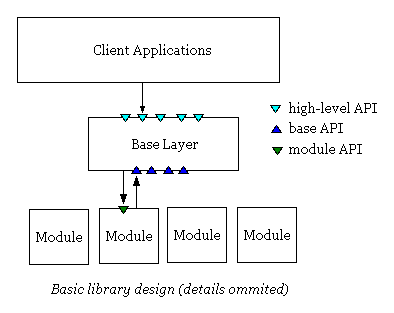
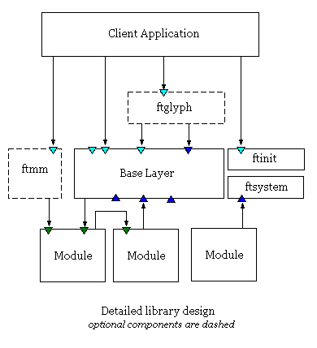

It is better to describe FreeType 2 as a collection of *components*.
Each one of them is a more or less abstract part of the library that is
in charge of one specific task. We will now explain the connections and
relationships between them.

A first brief description of this system of components could be as
follows.

-   Client applications typically call the FreeType 2 **high-level
    API**, whose functions are implemented in a single component called
    the *Base Layer*.

-   Depending on the context or the task, the base layer then calls one
    or more *module* components to perform the work. In most cases, the
    client application doesn\'t need to know which module was called.

-   The base layer also contains a set of routines that are used for
    generic things like memory allocation, list processing, I/O stream
    parsing, fixed-point computation, etc. These functions can also be
    called by a module at any time, and they form what is called the
    **low-level base API**.

This is illustrated by the following graphics (note that component entry
points are represented as colored triangles).

A few additional things must be added to complete this picture.

-   Some parts of the base layer can be replaced for specific builds of
    the library, and can thus be considered as components themselves.
    This is the case for the `ftsystem` component, which is in charge of
    implementing memory management and input stream access, as well as
    `ftinit`, which is in charge of library initialization (i.e.,
    implementing the
    [`FT_Init_FreeType`](../reference/ft2-base_interface#FT_Init_FreeType)
    function).

-   FreeType 2 comes also with a set of *optional components*, which can
    be used either as a convenience layer for client applications (e.g.,
    the `ftglyph` component, used to provide a simple API to manage
    glyph images independently of their internal representation), or to
    access format-specific features (e.g., the `ftmm` component used to
    access and manage Multiple Masters and OpenType variations fonts).

-   A module is capable of calling functions provided by another module.
    This is very useful to share code and tables between several font
    driver modules (for example, the `truetype` and `cff` modules both
    use the routines provided by the `sfnt` module).

-   Finally, FreeType provides *services*, which are a more light-weight
    way to access certain features across multiple modules, or to access
    some functionality provided by a single module.

    Services are internal to FreeType; similar to modules, it is
    necessary to 'load' a service, which can fail if the service\'s
    module is not available.

    An example for a service provided by a single module is 'winfonts'
    (see file `svwinfnt.h`), which allows access to the header of
    Windows bitmap fonts. An example for a service provided by multiple
    modules is 'multi-masters' (see file `svmm.h`) to manage the
    abovementioned `ftmm` component across the `truetype`, `type1`, and
    `cff` modules.

The following graphics shows the additional components (without
services).

Please take note of the following important points.

-   An optional component can use either the high-level or base API.
    This is the case of `ftglyph` in the above picture.

-   Some optional components can use module-specific interfaces or
    services ignored by the base layer. In the above example, `ftmm`
    directly accesses the Type 1 and TrueType modules to set and query
    data.

-   A replaceable component can provide a function of the high-level
    API. For example, `ftinit` provides `FT_Init_FreeType` to client
    applications.
