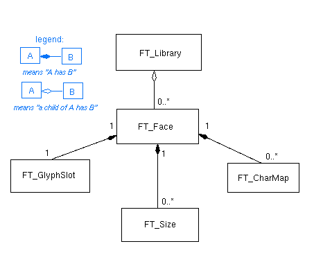

We will now explain the abstractions provided by FreeType 2 to client
applications to manage font files and data. As you would normally
expect, these are implemented through objects and classes.

### 1. Object Orientation in FreeType 2 {#section-1}

Though written in ANSI C, the library employs a few techniques,
inherited from object-oriented programming, to make it easy to extend.
Hence, the following conventions apply in the FreeType 2 source code.

1.  Almost all object types or classes have a corresponding *structure
    type* **and** a corresponding *structure pointer type*. The latter
    is called the *handle type* for the type or class.

    Consider that we need to manage objects of type 'foo' in FreeType 2.
    We would define the following structure and handle types as follows.

    ```c
    typedef struct FT_FooRec_*  FT_Foo;

    typedef struct  FT_FooRec_
    {
    /* fields for the 'foo' class */
    ...

    } FT_FooRec;
    ```

    As a convention, handle types use simple but meaningful identifiers
    beginning with `FT_`, as in `FT_Foo`, while structures use the same
    name with a `Rec` suffix appended to it ('Rec' is short for
    'record').

2.  Class derivation is achieved internally by wrapping base class
    structures into new ones. As an example, we define a 'foobar' class
    that is derived from 'foo'. We would do something like this.

    ```c
    typedef struct FT_FooBarRec_*  FT_FooBar;

    typedef struct  FT_FooBarRec_
    {
    /* the base 'foo' class fields */
    FT_FooRec  root;

    /* fields proper to the 'foobar' class */
    ...
    } FT_FooBarRec;
    ```

    As you can see, we ensure that a 'foobar' object is also a 'foo'
    object by placing a `FT_FooRec` at the start of the `FT_FooBarRec`
    definition. It is called **root** by convention.

    Note that an `FT_FooBar` handle also points to a 'foo' object and
    can be typecast to `FT_Foo`. Similarly, when the library returns an
    `FT_Foo` handle to client applications, the object can be really
    implemented as `FT_FooBar` or any derived class from 'foo'.

In the following sections of this chapter, we will refer to 'the
`FT_Foo` class' to indicate the type of objects handled through `FT_Foo`
pointers, be they implemented as 'foo' or 'foobar'.

### 2. The `FT_Library` class {#section-2}

This type corresponds to a handle to a single instance of the library.
Note that the corresponding structure `FT_LibraryRec` is not defined in
public header files, making client applications unable to access its
internal fields.

The library object is the *parent* of all other objects in FreeType 2.
You need to create a new library instance before doing anything else
with the library. Similarly, destroying it will automatically destroy
all its children (i.e., faces and modules).

Typical client applications should call
[`FT_Init_FreeType`](../reference/ft2-base_interface#FT_Init_FreeType)
in order to create a new library object, ready to be used for further
actions.

Another alternative is to create a fresh new library instance by calling
the function
[`FT_New_Library`](../reference/ft2-module_management#FT_New_Library),
defined in the `ftmodule.h` public header file. This function will
however return an 'empty' library instance with no module registered in
it. You can 'install' modules in the instance by calling
[`FT_Add_Module`](../reference/ft2-module_management#FT_Add_Module)
manually.

Calling `FT_Init_FreeType` is a lot more convenient, because this
function basically registers a set of default modules into each new
library instance. The way this list is accessed or computed is
determined at build time, and depends on the content of the `ftinit`
component. This process is explained in details later in this document.

For now, one should consider that library objects are created with
`FT_Init_FreeType`, and destroyed along with all children with
[`FT_Done_FreeType`](../reference/ft2-base_interface#FT_Done_FreeType).

### 3. The `FT_Face` class {#section-3}

A face object corresponds to a single *font face*, i.e., a specific
typeface with a specific style. For example, 'Arial' and 'Arial Italic'
correspond to two distinct faces.

A face object is normally created through
[`FT_New_Face`](../reference/ft2-base_interface#FT_New_Face). This
function takes the following parameters: an `FT_Library` handle, a C
file pathname used to indicate which font file to open, an index used to
decide which face to load from the file (a single file may contain
several faces in certain cases), and the address of an `FT_Face` handle.
It returns an error code.

```c
FT_Error  FT_New_Face( FT_Library   library,
                        const char*  filepathname,
                        FT_Long      face_index,
                        FT_Face*     face );
```

In case of success, the function returns `FT_Err_Ok` (which is value 0),
and the handle pointed to by the `face` parameter is set to a non-NULL
value.

Note that the face object contains several fields used to describe
global font data that can be accessed directly by client applications,
for example, the total number of glyphs in the face, the face\'s family
name, style name, the EM size for scalable formats, etc. For more
details, look at the
[`FT_FaceRec`](../reference/ft2-base_interface#FT_FaceRec)
definition in the FreeType 2 API Reference.

### 4. The `FT_Size` class {#section-4}

Each `FT_Face` object has one or more `FT_Size` objects. A *size object*
stores data specific to a given character width and height. Each newly
created face object has one size, which is directly accessible as
`face->size`.

The contents of a size object can be changed by calling
[`FT_Request_Size`](../reference/ft2-base_interface#FT_Request_Size),
[`FT_Set_Pixel_Sizes`](../reference/ft2-base_interface#FT_Set_Pixel_Sizes),
or
[`FT_Set_Char_Size`](../reference/ft2-base_interface#FT_Set_Char_Size).

A new size object can be created with
[`FT_New_Size`](../reference/ft2-sizes_management#FT_New_Size), and
destroyed manually with
[`FT_Done_Size`](../reference/ft2-sizes_management#FT_Done_Size).
Note that typical applications don\'t need to do this normally: usually
it is fully sufficient to use the default size object provided with each
`FT_Face`.

The public fields of `FT_Size` objects are defined in a very small
structure named
[`FT_SizeRec`](../reference/ft2-base_interface#FT_SizeRec).
However, it is important to understand that some font drivers define
their own derivatives of `FT_Size` to store important internal data that
is re-computed each time the character size changes. Most of the time,
these are size-specific *font hints*.

For example, the TrueType driver stores the scaled CVT (Control Value
Table) data that results from the execution of the 'prep' program in a
`TT_Size` structure, while the Type 1 driver stores scaled global
metrics (like blue zones) in a `T1_Size` object. Don\'t worry if you
don\'t understand the current paragraph; most of this stuff is highly
font format specific and doesn\'t need to be explained to client
developers :-)

### 5. The `FT_GlyphSlot` class {#section-5}

The purpose of a *glyph slot* is to provide a place where glyph images
can be loaded one by one easily, independently of the glyph image format
(bitmap, vector outline, or anything else).

Ideally, once a glyph slot is created, any glyph image can be loaded
into it without additional memory allocation. In practice, this is only
possible with certain formats like TrueType which explicitly provide
data to compute a slot\'s maximum size.

Another reason for glyph slots is that they are also used to hold
format-specific hints for a given glyphs as well as all other data
necessary to correctly load the glyph.

The base
[`FT_GlyphSlotRec`](../reference/ft2-base_interface#FT_GlyphSlotRec)
structure only presents glyph metrics and images to client applications,
while the actual implementation may contain more sophisticated data.

As an example, the TrueType-specific `TT_GlyphSlotRec` structure
contains additional fields to hold glyph-specific bytecode, transient
outlines used during the hinting process, and a few other things. The
Type 1-specific `T1_GlyphSlotRec` structure holds glyph hints during
glyph loading, as well as additional logic used to properly hint the
glyphs when a native Type 1 hinter is used.

Each face object has a single glyph slot that is directly accessible as
`face->glyph`.

### 6. The `FT_CharMap` class {#section-6}

The `FT_CharMap` type is a handle to character map objects, or
*charmaps*. A charmap is simply some sort of table or dictionary to
translate character codes in a given encoding into glyph indices for the
font.

A single face may contain several charmaps. Each one of them corresponds
to a given character repertoire, like Unicode, Apple Roman, Windows
codepages, and other encodings.

Each `FT_CharMap` object contains a 'platform' and an 'encoding' field
to precisely identify the character repertoire corresponding to it.

Each font format provides its own derivative of
[`FT_CharMapRec`](../reference/ft2-base_interface#FT_CharMapRec)
and thus needs to implement these objects.

### 7. Objects Relationship {#section-7}

The following diagram summarizes what we have just said regarding the
public objects managed by the library; it also describes their
relationship.



Note that this picture will be updated at the end of the next chapter,
related to *internal objects*.
