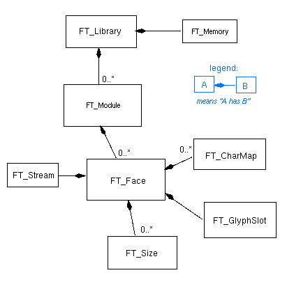

Let us have a look now at the *internal* objects that FreeType 2 uses,
i.e., those not directly available to client applications, and see how
they fit into the picture.

### 1. Memory Management {#section-1}

Most memory management operations are performed through three specific
routines of the base layer: `FT_Alloc`, `FT_Realloc`, and `FT_Free`.
Each one of these functions expects a `FT_Memory` handle as its first
parameter. Note, however, that there exist more, similar variants for
specific purposes which we skip here for simplicity.

`FT_Memory` is a pointer to a simple object that describes the current
memory pool or manager. It contains a small table of alloc, realloc, and
free functions. A memory manager is created at library initialization
time by `FT_Init_FreeType`, calling the (internal) function
`FT_New_Memory` provided by the `ftsystem` component.

By default, this manager uses the ANSI functions `malloc`, `realloc`,
and `free`. However, as `ftsystem` is a replaceable part of the base
layer, a specific build of the library could provide a different default
memory manager.

Even with a default build, client applications are still able to provide
their own memory manager by not calling `FT_Init_FreeType` but follow
these simple steps.

1.  Create a new `FT_Memory` object by hand. The definition of
    [`FT_MemoryRec`](../reference/ft2-system_interface#FT_MemoryRec)
    is located in the public header file `ftsystem.h`.

2.  Call
    [`FT_New_Library`](../reference/ft2-module_management#FT_New_Library)
    to create a new library instance using your custom memory manager.
    This new library doesn\'t yet contain any registered modules.

3.  Register the set of default modules by calling the function
    [`FT_Add_Default_Modules`](../reference/ft2-module_management#FT_Add_Default_Modules)
    provided by the `ftinit` component, or manually register your
    drivers by repeatedly calling
    [`FT_Add_Module`](../reference/ft2-module_management#FT_Add_Module).

### 2. Input Streams {#section-2}

Font files are always read through `FT_Stream` objects. The definition
of [`FT_StreamRec`](../reference/ft2-system_interface#FT_StreamRec)
is located in the public header file `ftsystem.h`, which allows client
developers to provide their own implementation of streams if they wish
so.

The function
[`FT_New_Face`](../reference/ft2-base_interface#FT_New_Face) always
automatically creates a new stream object from the C pathname given as
its second argument. This is achieved by calling the (internal) function
`FT_New_Stream` provided by the `ftsystem` component. As the latter is
replaceable, the implementation of streams may vary greatly between
platforms.

As an example, the default implementation of streams is located in the
file `src/base/ftsystem.c` and uses the ANSI functions `fopen`, `fseek`,
and `fread`. However, the Unix build of FreeType 2 provides an
alternative implementation that uses memory-mapped files, when available
on the host platform, resulting in a significant access speed-up.

FreeType distinguishes between memory-based and disk-based streams. In
the first case, all data is directly accessed in memory (e.g.,
ROM-based, write-only static data, and memory-mapped files), while in
the second, portions of the font files are read in chunks called
*frames*, and temporarily buffered similarly through typical seek and
read operations.

The FreeType stream sub-system also implements extremely efficient
algorithms to very quickly load structures from font files while
ensuring complete safety in the case of a 'broken file'.

The function
[`FT_New_Memory_Face`](../reference/ft2-base_interface#FT_New_Memory_Face)
can be used to directly create and open an `FT_Face` object from data
that is readily available in memory (including ROM-based fonts).

Finally, in the case where a custom input stream is needed, client
applications can use the function
[`FT_Open_Face`](../reference/ft2-base_interface#FT_Open_Face),
which can accept custom input streams. This may be useful in the case of
compressed or remote font files, or even embedded font files that need
to be extracted from certain documents.

Note that each face owns a single stream, which is also destroyed by
[`FT_Done_Face`](../reference/ft2-base_interface#FT_Done_Face).

### 3. Modules {#section-3}

A FreeType 2 module is itself a piece of code. However, the library
creates a single `FT_Module` object for each module that is registered
when `FT_Add_Module` is called.

The definition of `FT_ModuleRec` is not publicly available to client
applications. However, each *module type* is described by a simple
public structure named
[`FT_Module_Class`](../reference/ft2-module_management#FT_Module_Class),
defined in header file `ftmodule.h`, and is described later in this
document.

You need a pointer to an `FT_Module_Class` structure when calling
[`FT_Add_Module`](../reference/ft2-module_management#FT_Add_Module).

```c
FT_Error
FT_Add_Module( FT_Library              library,
            const FT_Module_Class*  clazz );
```

This function does the following tasks.

-   Check whether the library already holds a module object
    corresponding to the same module name as the one found in
    `FT_Module_Class`.

-   If this is the case, compare the module version number to see
    whether it is possible to *upgrade* the module to a new version. If
    the module class\'s version number is smaller than the already
    installed one, return immediately. Similarly, check that the version
    of FreeType 2 that is running is correct compared to the one
    required by the module.

-   Create a new `FT_Module` object, using data and flags of the module
    class to determine its byte size and how to properly initialize it.

-   If a module initializer is present in the module class, call it to
    complete the module object\'s initialization.

-   Add the new module to the library\'s list of 'registered' modules.
    In case of an upgrade, destroy the previous module object.

Note that this function doesn\'t return an `FT_Module` handle, given
that module objects are completely internal to the library (and client
applications shouldn\'t normally mess with them :-)

Finally, it is important to understand that FreeType 2 recognizes and
manages several kinds of modules. These will be explained later on in
this document.

-   *Renderer* modules are used to convert native glyph images to
    bitmaps or pixmaps. FreeType 2 comes with two renderer modules by
    default: one to generate monochrome bitmaps, the other to generate
    anti-aliased pixmaps.

-   *Font driver* modules are used to support one or more font formats.
    Typically, each font driver provides a specific implementation or
    derivative of `FT_Face`, `FT_Size`, `FT_GlyphSlot`, as well as
    `FT_CharMap`.

-   *Helper* modules are shared by several font drivers. For example,
    the `sfnt` module parses and manages tables found in SFNT-based font
    formats; it is then used by both the TrueType font and CFF drivers.

-   Finally, the *auto-hinter* module has a specific place in the
    library\'s design, as its role is to process vectorial glyph
    outlines, independently of their native font format, to produce
    optimal results at small pixel sizes.

Note that every `FT_Face` object is *owned* by the corresponding font
driver, depending on the original font file\'s format. This means that
all face objects are destroyed when a module is removed or unregistered
from a library instance (typically by calling the
[`FT_Remove_Module`](../reference/ft2-module_management#FT_Remove_Module)
function). Because of this, you should always take care that no
`FT_Face` object is opened when you upgrade or remove a module from a
library, as this could cause unexpected object deletion!

### 4. Summary {#section-4}

Finally, the following picture illustrates what has been said in this
section, as well as the previous, by presenting the complete object
graph of FreeType 2\'s base design.


