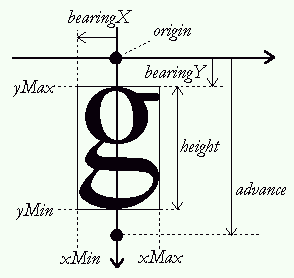

### 1\. Baseline, pens and layouts {#section-1}

The baseline is an imaginary line that is used to 'guide' glyphs when rendering
text.  It can be horizontal (e.g. Latin, Cyrillic, Arabic, etc.) or vertical
(e.g. Chinese, Japanese, Mongolian, etc.).  Moreover, to render text, a virtual
point, located on the baseline, called the _pen position_ or _origin_, is used
to locate glyphs.

Each layout uses a different convention for glyph placement:

* With horizontal layout, glyphs simply 'rest' on the baseline.  Text is
  rendered by incrementing the pen position, either to the right or to the
  left.

  The distance between two successive pen positions is glyph-specific and is
  called the _advance width_.  Note that its value is _always_ positive, even
  for right-to-left oriented scripts like Arabic.  This introduces some
    differences in the way text is rendered.

  _The pen position is always placed on the baseline._

  

* With a vertical layout, glyphs are centered around the baseline:

  

### 2\. Typographic metrics and bounding boxes {#section-2}

A various number of face metrics are defined for all glyphs in a given font.

* Ascent

  The distance from the baseline to the highest or upper grid coordinate used
  to place an outline point.  It is a positive value, due to the grid's
  orientation with the _Y_ axis upwards.

* Descent

  The distance from the baseline to the lowest grid coordinate used to place an
  outline point.  In FreeType, this is a negative value, due to the grid's
  orientation.  Note that in some font formats this is a positive value.

* Linegap

  The distance that must be placed between two lines of text.  The
  baseline-to-baseline distance should be computed as

  `linespace = ascent - descent + linegap`

  if you use the typographic values.

Other, simpler metrics are:

* Bounding box

  This is an imaginary box that encloses all glyphs from the font, usually as
  tightly as possible.  It is represented by four parameters, namely `xMin`,
  `yMin`, `xMax`, and `yMax`, that can be computed for any outline.  Their
  values can be in font units if measured in the original outline, or in
  integer (or fractional) pixel units when measured on scaled outlines.

  A common shorthand for the bounding box is 'bbox'.

* Internal leading

  This concept comes directly from the world of traditional typography.  It
  represents the amount of space within the _leading_ which is reserved for
  glyph features that lay outside of the EM square (like accentuation).  It
  usually can be computed as

  `internal leading = ascent - descent - EM_size`

* External leading

  This is another name for the line gap.

### 3\. Bearings and Advances {#section-3}

Each glyph has also distances called _bearings_ and _advances_.  The actual
values depend on the layout, as the same glyph can be used to render text
either horizontally or vertically:

* Left side bearing

  The horizontal distance from the current pen position to the glyph's left
  bbox edge.  It is positive for horizontal layouts, and in most cases negative
  for vertical ones.

  In the FreeType API, this is also called `bearingX`.  Another shorthand is
  'lsb'.

* Top side bearing

  The vertical distance from the baseline to the top of the glyph's bbox.  It
  is usually positive for horizontal layouts, and negative for vertical ones.

  In the FreeType API, this is also called `bearingY`.

* Advance width

  The horizontal distance to increment (for left-to-right writing) or decrement
  (for right-to-left writing) the pen position after a glyph has been rendered
  when processing text.  It is always positive for horizontal layouts, and zero
  for vertical ones.

  In the FreeType API, this is also called `advanceX`.

* Advance height

  The vertical distance to decrement the pen position after a glyph has been
  rendered.  It is always zero for horizontal layouts, and positive for
  vertical layouts.

  In the FreeType API, this is also called `advanceY`.

* Glyph width

  The glyph's horizontal extent.  For unscaled font coordinates, it is

  `glyph width = bbox.xMax - bbox.xMin`

  For scaled glyphs, its computation requests specific care, described in the
  grid-fitting chapter below.

* Glyph height

  The glyph's vertical extent. For unscaled font coordinates, it is

  `glyph height = bbox.yMax - bbox.yMin`

  For scaled glyphs, its computation requests specific care, described in the
  grid-fitting chapter below.

* Right side bearing

  Only used for horizontal layouts to describe the distance from the bbox's
  right edge to the advance width.  In most cases it is a non-negative number:

  `right side bearing = advance_width - left_side_bearing - (xMax-xMin)`

  A common shorthand for this value is 'rsb'.

Here is a picture giving all the details for horizontal metrics:

And here is another one for the vertical metrics:

### 4\. The effects of grid-fitting {#section-4}

Because hinting aligns the glyph's control points to the pixel grid, this
process slightly modifies the dimensions of character images in ways that
differ from simple scaling.

For example, the image of the lowercase 'm' letter sometimes fits a square in
the master grid.  However, to make it readable at small pixel sizes, hinting
tends to enlarge its scaled outline horizontally in order to keep its three
legs distinctly visible, resulting in a wider character bitmap.

The glyph metrics are also influenced by the grid-fitting process:

* The image's width and height are altered.  Even if this is only by one pixel,
  it can make a big difference at small pixel sizes.

* The image's bounding box is modified, thus modifying the bearings.

* The advances must be updated.  For example, the advance width must be
  incremented if the hinted bitmap is larger than the scaled one, to reflect
  the augmented glyph width.

This has some implications:

* Because of hinting, simply scaling the font ascent or descent might not give
  correct results.  A possible solution is to keep the ceiling of the scaled
  ascent, and floor of the scaled descent.

* There is no easy way to get the hinted glyph and advance widths of a range of
  glyphs, as hinting works differently on each outline.  The only solution is
  to hint each glyph separately and record the returned values (for example in
  a cache).  Some formats, like TrueType, even include a table of pre-computed
  values for a small set of common character pixel sizes.

* Hinting depends on the final character width and height in pixels, which
  means that it is highly resolution-dependent.  This property makes correct
  WYSIWYG layouts difficult to implement.

Performing 2D transformations on glyph outlines is very easy with FreeType.
However, when using translation on hinted outlines, one should always take care
of **exclusively using integer pixel distances** (which means that the
parameters to the `FT_Outline_Translate` API function should all be multiples
of 64, as the point coordinates are in 26.6 fixed-point format).  Otherwise,
the translation will simply _ruin the hinter's work_, resulting in very low
quality bitmaps!

### 5\. Text widths and bounding box {#section-5}

As seen before, the  'origin' of a given glyph corresponds to the position of
the pen on the baseline.  It is not necessarily located on one of the glyph's
bounding box corners, unlike many typical bitmapped font formats.  In some
cases, the origin can be out of the bounding box, in others, it can be within
it, depending on the shape of the given glyph.

Likewise, the glyph's 'advance width' is the increment to apply to the pen
position during layout, and is not related to the glyph's 'width', which really
is the glyph's bounding width.

The same conventions apply to strings of text.  This means that:

* The bounding box of a given string of text doesn't necessarily contain the
  text cursor, nor is the latter located on one of its corners.

* The string's advance width isn't related to its bounding box dimensions.
  Especially if it contains beginning and terminal spaces or tabs.

* Finally, additional processing like kerning creates strings of text whose
  dimensions are not directly related to the simple juxtaposition of individual
  glyph metrics.  For example, the advance width of  'VA' isn't the sum of the
  advances of 'V' and 'A' take separately.
