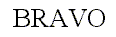
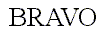
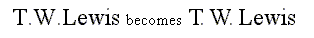
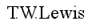

The term _kerning_ refers to specific information used to adjust the relative
positions of successive glyphs in a string of text.  This section describes
several types of kerning information, as well as the way to process them when
performing text layout.

### 1\. Kerning pairs {#section-1}

Kerning consists of modifying the spacing between two successive glyphs
according to their outlines.  For example, a  'T' and a 'y' can be easily moved
closer, as the top of the  'y' fits nicely under the upper right bar of the
'T'.

When laying out text with only their standard widths, some consecutive glyphs
seem a bit too close or too distant.  For example, the space between the 'A'
and the 'V' in the following word seems a little wider than needed.

Compare this to the same word, where the distance between these two letters has
been slightly reduced:

As you can see, this adjustment can make a great difference.  Some font faces
thus include a table containing kerning distances for a set of given glyph
pairs for text layout.

* The pairs are ordered, i.e., the space for pair '(A,V)' isn't necessarily the
  space for pair  '(V,A)'.  They also use glyph indices, not character codes.

* Kerning distances can be expressed in horizontal or vertical directions,
  depending on the layout and/or the script.  For example, some horizontal
  layouts like Arabic can make use of vertical kerning adjustments between
  successive glyphs.  A vertical script can have vertical kerning distances.

* Kerning distances are expressed in grid units.  They are usually oriented in
  the _X_ axis, which means that a negative value indicates that two glyphs
  must be set closer in a horizontal layout.

Note that OpenType fonts (OTF) provide two distinct mechanisms for kerning,
using the  'kern' and 'GPOS' tables, respectively, which are part of the OTF
files.  Older fonts only contain the former, while recent fonts contain both
tables or even 'GPOS' data only.  FreeType only supports kerning via the
(rather simple)  'kern' table.  For the interpretation of kerning data in the
(highly sophisticated)  'GPOS' table you need a higher-level library like
[ICU](http://icu-project.org/) or [HarfBuzz](http://harfbuzz.org) since it can
be context dependent (this is, the kerning may vary depending on the position
within a text string, for example).

### 2\. Applying kerning {#section-2}

Applying kerning when rendering text is a rather easy process.  It merely
consists in adding the scaled kern distance to the pen position before
rendering the next glyph.  However, the typographically correct renderer must
take a few more details in consideration.

The  'sliding dot' problem is a good example: Many font faces include a kerning
distance between capital letters like  'T' or 'F' and a following dot ( '.'),
in order to slide the latter glyph just right to their main leg.

This sometimes requires additional adjustments between the dot and the letter
following it, depending on the shapes of the enclosing letters.  When applying
'standard' kerning adjustments, the previous sentence would become

This is clearly too contracted.  The solution here, as exhibited in the first
example, is to only slide the dots if the conditions fit.  Of course, this
requires a certain knowledge of the text's meaning, and this is exactly what
'GPOS' kerning is good for: Depending on the context, different kerning values
can be applied to get a typographically correct result.
