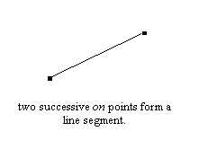
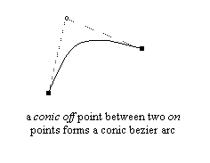
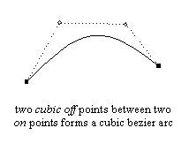
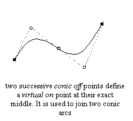
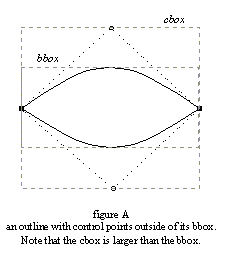
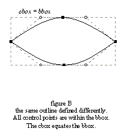

The purpose of this section is to present the way FreeType manages vectorial
outlines, as well as the most common operations that can be applied on them.

### 1\. FreeType outline description and structure {#section-1}

#### a. Outline curve decomposition

An outline is described as a series of closed contours in the 2D plane. Each
contour is made of a series of line segments and Bézier arcs. Depending on the
file format, these can be second-order or third-order polynomials. The former
are also called quadratic or conic arcs, and they are used in the TrueType
format. The latter are called cubic arcs and are mostly used in the PostScript
Type 1, CFF, and CFF2 formats.

Each arc is described through a series of start, end, and control points.  Each
point of the outline has a specific tag which indicates whether it is describes
a line segment or an arc.  The tags can take the following values:

Tag                  | Description
---------------------|------------
`FT_CURVE_TAG_ON`    | Used when the point is  'on' the curve. This corresponds to start and end points of segments and arcs.  The other tags specify what is called an 'off' point, i.e., a point which isn't located on the contour itself, but serves as a control point for a Bézier arc.
`FT_CURVE_TAG_CONIC` | Used for an  'off' point used to control a conic Bézier arc.
`FT_CURVE_TAG_CUBIC` | Used for an  'off' point used to control a cubic Bézier arc.

Use the `FT_CURVE_TAG(tag)` macro to filter out other, internally used flags.

The following rules are applied to decompose the contour's points into segments
and arcs:

* Two successive  'on' points indicate a line segment joining them.

* One conic  'off' point between two 'on' points indicates a conic Bézier arc,
  the  'off' point being the control point, and the  'on' ones the start and
  end points.

* Two successive cubic  'off' points between two  'on' points indicate a cubic
  Bézier arc.  There must be exactly two cubic control points and two  'on'
  points for each cubic arc (using a single cubic  'off' point between two
  'on' points is forbidden, for example).

* Two successive conic  'off' points force the rasterizer to create (during the
  scan-line conversion process exclusively) a virtual 'on' point inbetween, at
  their exact middle.  This greatly facilitates the definition of successive
  conic Bézier arcs.  Moreover, it is the way outlines are described in the
  TrueType specification.

* The last point in a contour uses the first as an end point to create a closed
  contour.  For example, if the last two points of a contour were an  'on' point
  followed by a conic  'off' point, the first point in the contour would be used
  as final point to create an  'on' – 'off' – 'on' sequence as described above.

* The first point in a contour can be a conic 'off' point itself; in that case,
  use the last point of the contour as the contour's starting point.  If the
  last point is a conic  'off' point itself, start the contour with the virtual
  'on' point between the last and first point of the contour.

Note that it is possible to mix conic and cubic arcs in a single contour,
however, no font driver of FreeType produces such outlines currently.

<table class="vertical-space">
<tr>
    <td>
    
    </td>
    <td>
    
    </td>
</tr>
<tr>
    <td>
    
    </td>
    <td>
    
    </td>
</tr>
</table>

#### b. The `FT_Outline` descriptor

A FreeType outline is described through a simple structure called
[`FT_Outline`](../reference/ft2-outline_processing#FT_Outline).  Right
now, the following fields are of interest:

Field        | Description
-------------|------------
`n_points`   | The number of points in the outline
`n_contours` | The number of contours in the outline
`points`     | Array of point coordinates
`contours`   | Array of contour end indices
`tags`       | Array of point flags

Here, `points` is a pointer to an array of
[`FT_Vector`](../reference/ft2-basic_types#FT_Vector) records, used to
store the vectorial coordinates of each outline point.  These are expressed in
1/64th of a pixel, which is also known as the _26.6 fixed-point format_.

`contours` is an array of point indices to delimit contours in the outline.
For example, the first contour always starts at point 0, and ends at point
`contours[0]`.  The second contour starts at point `contours[0]+1` and ends at
`contours[1]`, etc.  To traverse these points in a callback based manner, use
[`FT_Outline_Decompose`](../reference/ft2-outline_processing#FT_Outline_Decompose).

Note that each contour is closed, and that the value of `n_points` should be equal
to `contours[n_contours-1]+1` for a valid outline.

Finally, `tags` is an array of bytes, used to store each outline point's tag.

### 2\. Bounding and control box computations {#section-2}

As described earlier, a _bounding box_ (also called _bbox_) is simply a
rectangle that completely encloses the shape of a given outline.  The
interesting case is the smallest bounding box possible, and in the following we
subsume this under the term 'bounding box'.  Because of the way arcs are
defined, Bézier control points are not necessarily contained within an
outline's (smallest) bounding box.

Such a situation happens if one Bézier arc is, for example, the upper edge of an
outline and an 'off' point happens to be above the bbox.  However, it is very
rare in the case of character outlines because most font designers and creation
tools always place  'on' points at the extrema of each curved edges (as both the
TrueType and PostScript specifications recommend), making hinting much easier.

We thus define the _control box_ (also called _cbox_) as the smallest possible
rectangle that encloses all points of a given outline (including its 'off'
points).  Clearly, it always includes the bbox, and the two boxes are identical
in most cases.

Unlike the bbox, the cbox is much faster to compute.

<table class="vertical-space">
<tr>
    <td>
    
    </td>
    <td>
    
    </td>
</tr>
</table>

Control and bounding boxes can be computed automatically using the functions
[`FT_Outline_Get_CBox`](../reference/ft2-outline_processing#FT_Outline_Get_CBox)
and
[`FT_Outline_Get_BBox`](../reference/ft2-outline_processing#FT_Outline_Get_BBox).
The former function is always very fast, while the latter _may_ be slow in the
case of 'outside' control points (as it needs to find the extreme of conic and
cubic arcs for 'perfect' computations).  If this isn't the case, it is as fast
as computing the control box.

Note also that even though most glyph outlines have equal cbox and bbox values
to ease hinting, this is not necessarily the case if a transformation like
rotation is applied to them.

### 3\. Coordinates, scaling and grid-fitting {#section-3}

An outline point's vectorial coordinates are expressed in the 26.6 format, i.e.
in 1/64th of a pixel, hence the coordinates  `(1.0,-2.5)` is stored as the
integer pair  `(64,-192)`, to name an example.

After a glyph outline is scaled from the EM grid (in font units) to the current
character dimensions, the hinter or grid-fitter is in charge of aligning
important outline points (mainly edge delimiters) to the pixel grid.  Even
though this process is much too complex to be described in a few lines, its
purpose is mainly to round point positions, while trying to preserve important
properties like widths, stems, etc.

The following operations can be used to round vectorial distances in the 26.6
format to the grid:

    round( x )   == ( x + 32 ) & -64
    floor( x )   ==          x & -64
    ceiling( x ) == ( x + 63 ) & -64

Once a glyph outline is grid-fitted or transformed, it often is interesting to
compute the glyph image's pixel dimensions before rendering it.  To do so, one
has to consider the following:

The scan-line converter draws all the pixels whose _centers_ fall inside the
glyph shape.  In B/W rendering mode, it can also detect _drop-outs_, i.e.,
discontinuities coming from extremely thin shape fragments, in order to draw
the  'missing' pixels.  These new pixels are always located at a distance less
than half of a pixel but it is not easy to predict where they will appear
before rendering.

This leads to the following computations:

* compute the bbox

* grid-fit the bounding box with the following:

      xmin = floor( bbox.xMin )
      xmax = ceiling( bbox.xMax )
      ymin = floor( bbox.yMin )
      ymax = ceiling( bbox.yMax )

* return pixel dimensions, i.e.,

      width = (xmax - xmin)/64
  
  and

      height = (ymax - ymin)/64

By grid-fitting the bounding box, it is guaranteed that all the pixel centers
that are to be drawn, _including those coming from drop-out control_, will be
_within_ the adjusted box.  Then the box's dimensions in pixels can be
computed.

Note also that, when translating a grid-fitted outline, one should _always use
integer distances_ to move an outline in the 2D plane.  Otherwise, glyph edges
won't be aligned on the pixel grid anymore, and the hinter's work will be lost,
producing _very low quality_ bitmaps and pixmaps.
