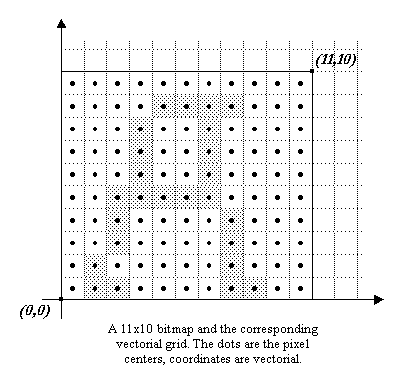
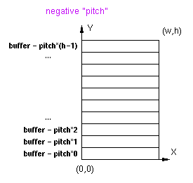
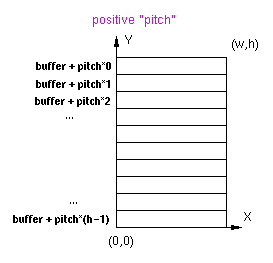
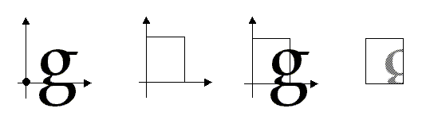

The purpose of this section is to present the way FreeType manages bitmaps and
pixmaps, and how they relate to the concepts previously defined.  The
relationship between vectorial and pixel coordinates is explained.

### 1\. Vectorial versus pixel coordinates {#section-1}

This sub-section explains the difference between vectorial and pixel
coordinates.  To make things clear, brackets will be used to describe pixel
coordinates, e.g.  `[3,5]`, while parentheses will be used for vectorial ones,
e.g.  `(-2, 3.5)`.

In the pixel case, as we use the _Y upwards_ convention; the coordinate 
`[0, 0]` always refers to the _lower left pixel_ of a bitmap, while coordinate
`[width-1, rows-1]` to its _upper right pixel_.

In the vectorial case, point coordinates are expressed in floating units, like
`(1.25, -2.3)`.  Such a position doesn't refer to a given pixel, but simply to
an immaterial point in the 2D plane.

The pixels themselves are indeed _square boxes_ of the 2D plane, whose centers
lie in half pixel coordinates.  For example, the lower left pixel of a bitmap
is delimited by the square `(0, 0)-(1, 1)`, its center being at location
`(0.5, 0.5)`.

This introduces some differences when computing distances.  For example, the
_length_ in pixels of the line `[0, 0]-[10, 0]` is 11\.  However, the vectorial
distance between `(0, 0)-(10, 0)` covers exactly 10 pixel centers, hence its
length is 10.

### 2\. The `FT_Bitmap` descriptor {#section-2}

In FreeType, a bitmap or pixmap is described through a single structure, called
[`FT_Bitmap`](../reference/ft2-basic_types.html#FT_Bitmap).  The fields we are
interested in are:

Field        | Description
-------------|------------
`rows`       | The number of rows, i.e. lines, in the bitmap
`width`      | The number of horizontal pixels in the bitmap
`pitch`      | Its absolute value is the number of bytes per bitmap line; it can be either positive or negative depending on the bitmap's vertical orientation
`buffer`     | A typeless pointer to the bitmap pixel buffer
`pixel_mode` | An enumeration used to describe the pixel format of the bitmap; examples are `ft_pixel_mode_mono` for 1-bit monochrome bitmaps and `ft_pixel_mode_grays` for 8-bit anti-aliased 'gray' values
`num_grays`  |  This is only used for  'gray' pixel modes, it gives the number of gray levels used to describe the anti-aliased gray levels (256 by default with FreeType 2)

Note that the sign of the `pitch` field determines whether the rows in the
pixel buffer are stored in ascending or descending order.

Remember that FreeType uses the _Y upwards_ convention in the 2D plane, which
means that a coordinate of `(0, 0)` always refer to the _lower-left corner_ of
a bitmap.

If the pitch is positive, the rows are stored in decreasing vertical position;
the first bytes of the pixel buffer are part of the _upper_ bitmap row.

On the opposite, if the pitch is negative, the first bytes of the pixel buffer
are part of the _lower_ bitmap row.

In all cases, one can see the pitch as the byte increment needed to skip to the
_next lower scanline_ in a given bitmap buffer.

<table class="vertical-space">
<tr>
    <td>

    </td>
    <td>

    </td>
</tr>
</table>

The  'positive pitch' convention is very often used, though some systems might
need the other.

### 3\. Converting outlines into bitmaps and pixmaps {#section-3}

Generating a bitmap or pixmap image from a vectorial image is easy with
FreeType.  However, one must understand a few points regarding the positioning
of the outline in the 2D plane before converting it to a bitmap:

* The glyph loader and hinter always places the outline in the 2D plane so that
  `(0, 0)` matches its character origin.  This means that the glyph's outline
  (and corresponding bounding box), can be placed anywhere in the 2D plane (see
  the graphics in section III).

* The target bitmap's area is mapped to the 2D plane, with its lower left
  corner at `(0, 0)`.  This means that a bitmap or pixmap of dimensions
  `[w, h]` will be mapped to a 2D rectangle window delimited by
  `(0, 0)-(w, h)`.

* When scan-converting the outline, everything that falls within the bitmap
  window is rendered, the rest is ignored.

A common mistake made by many developers when they begin using FreeType is
believing that a loaded outline can be directly rendered in a bitmap of
adequate dimensions.  The following images illustrate why this is a problem.

* The first image shows a loaded outline in the 2D plane.

* The second one shows the target window for a bitmap of arbitrary dimensions
  [`w`, `h`].

* The third one shows the juxtaposition of the outline and window in the 2D
  plane.

* The last image shows what will really be rendered in the bitmap.

Indeed, in nearly all cases, the loaded or transformed outline must be
translated before it is rendered into a target bitmap, in order to adjust its
position relative to the target window.

For example, the correct way of creating a stand-alone glyph bitmap is as
follows:

* Get the size of the glyph bitmap. It can be computed directly from the glyph
  metrics, or by computing its bounding box (this is useful when a
  transformation has been applied to the outline after loading it, as the glyph
  metrics are not valid anymore).

* Create the bitmap with the computed dimensions.  Don't forget to fill the
  pixel buffer with the background color.

* Translate the outline so that its lower left corner matches `(0, 0)`.  Don't
  forget that in order to preserve hinting, one should use integer, i.e.,
  rounded distances (of course, this isn't required if preserving hinting
  information doesn't matter, like with rotated text).  Usually, this means
  translating with a vector `(-ROUND(xMin), -ROUND(yMin))`.

* Call the rendering function (it can be
  [`FT_Outline_Render`](../reference/ft2-outline_processing.html#FT_Outline_Render),
  for example).

In the case where one wants to write glyph images directly into a large bitmap,
the outlines must be translated so that their vectorial position corresponds to
the current text cursor or character origin.
