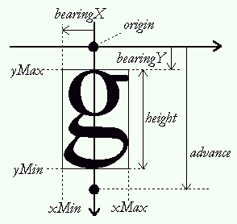

## 1. Glyph Metrics {#section-1}

Glyph metrics are, as the name suggests, certain distances associated
with each glyph that describe how to position this glyph while creating
a text layout.

There are usually two sets of metrics for a single glyph: Those used to
represent glyphs in horizontal text layouts (Latin, Cyrillic, Arabic,
Hebrew, etc.), and those used to represent glyphs in vertical text
layouts (Chinese, Japanese, Korean, Mongolian, etc.).

Note that only a few font formats provide vertical metrics. You can test
whether a given face object contains them by using the macro
[`FT_HAS_VERTICAL`](../reference/ft2-base_interface#FT_HAS_VERTICAL),
which returns true if appropriate.

Individual glyph metrics can be accessed by first loading the glyph in a
face\'s glyph slot, then accessing them through the
`face->glyph->metrics` structure, whose type is
[`FT_Glyph_Metrics`](../reference/ft2-base_interface#FT_Glyph_Metrics).
We will discuss this in more detail below; for now, we only note that it
contains the following fields.

width
:   This is the width of the glyph image\'s bounding box. It is
    independent of the layout direction.

height
:   This is the height of the glyph image\'s bounding box. It is
    independent of the layout direction. Be careful not to confuse it
    with the 'height' field in the
    [`FT_Size_Metrics`](../reference/ft2-base_interface#FT_Size_Metrics)
    structure.

horiBearingX
:   For *horizontal text layouts*, this is the horizontal distance from
    the current cursor position to the leftmost border of the glyph
    image\'s bounding box.

horiBearingY
:   For *horizontal text layouts*, this is the vertical distance from
    the current cursor position (on the baseline) to the topmost border
    of the glyph image\'s bounding box.

horiAdvance
:   For *horizontal text layouts*, this is the horizontal distance to
    increment the pen position when the glyph is drawn as part of a
    string of text.

vertBearingX
:   For *vertical text layouts*, this is the horizontal distance from
    the current cursor position to the leftmost border of the glyph
    image\'s bounding box.

vertBearingY
:   For *vertical text layouts*, this is the vertical distance from the
    current cursor position (on the baseline) to the topmost border of
    the glyph image\'s bounding box.

vertAdvance
:   For *vertical text layouts*, this is the vertical distance used to
    increment the pen position when the glyph is drawn as part of a
    string of text.

As not all fonts do contain vertical metrics, the values of
`vertBearingX`, `vertBearingY` and `vertAdvance` should not be
considered reliable if `FT_HAS_VERTICAL` returns false.

The following graphics illustrate the metrics more clearly. In case a
distance is directed, it is marked with a single arrow, indicating a
positive value. The first image displays horizontal metrics, where the
baseline is the horizontal axis.


For vertical text layouts, the baseline is vertical, identical to the
vertical axis. Contrary to all other arrows, `bearingX` shows a negative
value in this image.



The metrics found in `face->glyph->metrics` are normally expressed in
26.6 pixel format (i.e., 1/64th of pixels), unless you use the
`FT_LOAD_NO_SCALE` flag when calling `FT_Load_Glyph` or `FT_Load_Char`.
In this case, the metrics are expressed in original font units.

The glyph slot object has also a few other interesting fields that eases
a developer\'s work. You can access them through `face->glyph->xxx`,
where `xxx` is one of the following fields.

advance
:   This field is a `FT_Vector` that holds the transformed advance for
    the glyph. That is useful when you are using a transformation
    through `FT_Set_Transform`, as shown in the [rotated text
    example](step1.html#transformed-text) of part I. Other than that,
    its value is by default (metrics.horiAdvance,0), unless you specify
    `FT_LOAD_VERTICAL` when loading the glyph image; it is then
    (0,metrics.vertAdvance).

linearHoriAdvance
:   This field contains the linearly scaled value of the glyph\'s
    horizontal advance width. Indeed, the value of `metrics.horiAdvance`
    that is returned in the glyph slot is normally rounded to integer
    pixel coordinates (i.e., being a multiple of 64) by the font driver
    that actually loads the glyph image. `linearHoriAdvance` is a 16.16
    fixed-point number that gives the value of the original glyph
    advance width in 1/65536th of pixels. It can be use to perform
    pseudo device-independent text layouts.

linearVertAdvance
:   This is the similar to `linearHoriAdvance` but for the glyph\'s
    vertical advance height. Its value is only reliable if the font face
    contains vertical metrics.

## 2. Managing Glyph Images {#section-2}

The glyph image that is loaded in a glyph slot can be converted into a
bitmap, either by using `FT_LOAD_RENDER` when loading it, or by calling
[`FT_Render_Glyph`](../reference/ft2-base_interface#FT_Render_Glyph).
Each time you load a new glyph image, the previous one is erased from
the glyph slot.

There are situations, however, where you may need to extract this image
from the glyph slot in order to cache it within your application, and
even perform additional transformations and measures on it before
converting it to a bitmap.

The FreeType 2 API has a specific extension that is capable of dealing
with glyph images in a flexible and generic way. To use it, you first
need to include the
[`FT_GLYPH_H`](../reference/ft2-header_file_macros#FT_GLYPH_H)
header file.

```c
#include FT_GLYPH_H
```

### a.Extracting the Glyph Image

You can extract a single glyph image very easily. Here some code that
shows how to do it.

```c
FT_Glyph  glyph; /* a handle to the glyph image */


...
error = FT_Load_Glyph( face, glyph_index, FT_LOAD_NORMAL );
if ( error ) { ... }

error = FT_Get_Glyph( face->glyph, &glyph );
if ( error ) { ... }
```

The following steps are performed.

-   Create a variable named `glyph`, of type
    [`FT_Glyph`](../reference/ft2-glyph_management#FT_Glyph). This
    is a handle (pointer) to an individual glyph image.
-   Load the glyph image in the normal way into the face\'s glyph slot.
    We don\'t use `FT_LOAD_RENDER` because we want to grab a scalable
    glyph image that we can transform later on.
-   Copy the glyph image from the slot into a new `FT_Glyph` object by
    calling
    [`FT_Get_Glyph`](../reference/ft2-glyph_management#FT_Get_Glyph).
    This function returns an error code and sets `glyph`.

It is important to note that the extracted glyph is in the same format
as the original one that is still in the slot. For example, if we are
loading a glyph from a TrueType font file, the glyph image is really a
scalable vector outline. You can access the field `glyph->format` if you
want to know exactly how the glyph is modeled and stored.

A new glyph object can be destroyed with a call to
[`FT_Done_Glyph`](../reference/ft2-glyph_management#FT_Done_Glyph).

The glyph object contains exactly one glyph image and a 2D vector
representing the glyph\'s advance in 16.16 fixed-point coordinates. The
latter can be accessed directly as `glyph->advance`

Note that unlike other FreeType objects, the library doesn\'t keep a
list of all allocated glyph objects. This means you have to destroy them
yourself instead of relying on `FT_Done_FreeType` doing all the
clean-up.

### b. Transforming & Copying the Glyph Image

If the glyph image is scalable (i.e., if `glyph->format` is not equal to
`FT_GLYPH_FORMAT_BITMAP`), it is possible to transform the image anytime
by a call to
[`FT_Glyph_Transform`](../reference/ft2-glyph_management#FT_Glyph_Transform).

You can also copy a single glyph image with
[`FT_Glyph_Copy`](../reference/ft2-glyph_management#FT_Glyph_Copy).

```c
FT_Glyph   glyph, glyph2;
FT_Matrix  matrix;
FT_Vector  delta;


... load glyph image in `glyph' ...

/* copy glyph to glyph2 */

error = FT_Glyph_Copy( glyph, &glyph2 );
if ( error ) { ... could not copy (out of memory) ... }

/* translate `glyph' */

delta.x = -100 * 64; /* coordinates are in 26.6 pixel format */
delta.y =   50 * 64;

FT_Glyph_Transform( glyph, 0, &delta );

/* transform glyph2 (horizontal shear) */

matrix.xx = 0x10000L;
matrix.xy = 0.12 * 0x10000L;
matrix.yx = 0;
matrix.yy = 0x10000L;

FT_Glyph_Transform( glyph2, &matrix, 0 );
```

Note that the 2×2 transformation matrix is always applied to the 16.16
advance vector in the glyph; you thus don\'t need to recompute it.

### c. Measuring the Glyph Image

You can also retrieve the control (bounding) box of any glyph image
(scalable or not) through the
[`FT_Glyph_Get_CBox`](../reference/ft2-glyph_management#FT_Glyph_Get_CBox)
function.

```c
FT_BBox  bbox;


...
FT_Glyph_Get_CBox( glyph, bbox_mode, &bbox );
```

Coordinates are relative to the glyph origin (0,0), using the y upwards
convention. This function takes a special argument, the *bbox mode*, to
indicate how box coordinates are expressed.

If the glyph has been loaded with `FT_LOAD_NO_SCALE`, `bbox_mode` must
be set to `FT_GLYPH_BBOX_UNSCALED` to get unscaled font units in 26.6
pixel format. The value `FT_GLYPH_BBOX_SUBPIXELS` is another name for
this constant.

Note that the box\'s maximum coordinates are exclusive, which means that
you can always compute the width and height of the glyph image
(regardless of using integer or 26.6 coordinates) with a simple
subtraction.

```
  width  = bbox.xMax - bbox.xMin;
  height = bbox.yMax - bbox.yMin;
```

Note also that for 26.6 coordinates, if `FT_GLYPH_BBOX_GRIDFIT` is used
as the bbox mode, the coordinates are also grid-fitted, which
corresponds to the following four lines of pseudo-code.

```
  bbox.xMin = FLOOR( bbox.xMin )
  bbox.yMin = FLOOR( bbox.yMin )
  bbox.xMax = CEILING( bbox.xMax )
  bbox.yMax = CEILING( bbox.yMax )
```

To get the bbox in *integer* pixel coordinates, set `bbox_mode` to
`FT_GLYPH_BBOX_TRUNCATE`.

Finally, to get the bounding box in grid-fitted pixel coordinates, set
`bbox_mode` to `FT_GLYPH_BBOX_PIXELS`.

\[Computing *exact* bounding boxes can be done with function
[`FT_Outline_Get_BBox`](../reference/ft2-outline_processing#FT_Outline_Get_BBox),
at the cost of slower execution. You probably don\'t need it with the
possible exception of rotated glyphs.\]

### d. Converting the Glyph Image to a Bitmap

You may need to convert the glyph object to a bitmap once you have
conveniently cached or transformed it. This can be done easily with the
[`FT_Glyph_To_Bitmap`](../reference/ft2-glyph_management) function,
which handles any glyph object.

      FT_Vector  origin;
      
      
      origin.x = 32; /* 1/2 pixel in 26.6 format */
      origin.y = 0;
      
      error = FT_Glyph_To_Bitmap(
                &glyph,
                render_mode,
                &origin,
                1 );          /* destroy original image == true */

Some notes.

-   The first parameter is the address of the source glyph\'s handle.
    When the function is called, it reads it to access the source glyph
    object. After the call, the handle points to a *new* glyph object
    that contains the rendered bitmap.
-   The second parameter is a standard render mode to specify what kind
    of bitmap we want. For example, it can be `FT_RENDER_MODE_DEFAULT`
    for an 8-bit anti-aliased pixmap, or `FT_RENDER_MODE_MONO` for a
    1-bit monochrome bitmap.
-   The third parameter is a pointer to a two-dimensional vector to
    translate the source glyph image before the conversion. After the
    call, the source image is translated back to its original position
    (and is thus left unchanged). If you do not need to translate the
    source glyph before rendering, set this pointer to NULL.
-   The last parameter is a boolean that indicates whether the source
    glyph object should be destroyed by the function. If false, the
    original glyph object is never destroyed, even if its handle is lost
    (it is up to client applications to keep it).

The new glyph object always contains a bitmap (if no error is returned),
and you must *typecast* its handle to the `FT_BitmapGlyph` type in order
to access its content. This type is a sort of 'subclass' of `FT_Glyph`
that contains additional fields (see
[`FT_BitmapGlyphRec`](../reference/ft2-glyph_management#FT_BitmapGlyphRec)).

left
:   Just like the `bitmap_left` field of a glyph slot, this is the
    horizontal distance from the glyph origin (0,0) to the leftmost
    pixel of the glyph bitmap. It is expressed in integer pixels.

top
:   Just like the `bitmap_top` field of a glyph slot, this is the
    vertical distance from the glyph origin (0,0) to the topmost pixel
    of the glyph bitmap (more precise, to the pixel just above the
    bitmap). This distance is expressed in integer pixels, and is
    positive for upwards y.

bitmap
:   This is a bitmap descriptor for the glyph object, just like the
    `bitmap` field in a glyph slot.

## 3. Global Glyph Metrics {#section-3}

Unlike glyph metrics, global metrics are used to describe distances and
features of a whole font face. They can be expressed either in 26.6
pixel format or in (unscaled) font units for scalable formats.

### a. Design global metrics

For scalable formats, all global metrics are expressed in font units in
order to be later scaled to the device space, according to the rules
described in the last section of this tutorial part. You can access them
directly as fields of an `FT_Face` handle.

However, you need to check that the font face\'s format is scalable
before using them. One can do it with macro `FT_IS_SCALABLE`, which
returns true when appropriate.

Here a table of the global design metrics for scalable faces.

units\_per\_EM
:   This is the size of the EM square for the font face. It is used by
    scalable formats to scale design coordinates to device pixels, as
    described in the last section of this tutorial part. Its value
    usually is 2048 (for TrueType) or 1000 (for Type 1 or CFF), but
    other values are possible, too. It is set to 1 for fixed-size
    formats like FNT, FON, PCF, or BDF.

bbox
:   The global bounding box is defined as the smallest rectangle that
    can enclose all the glyphs in a font face.

ascender
:   The ascender is the vertical distance from the horizontal baseline
    to the highest 'character' coordinate in a font face. Unfortunately,
    font formats don\'t define the ascender in a uniform way. For some
    formats, it represents the ascent of all capital latin characters
    (without accents), for others it is the ascent of the highest
    accented character, and finally, other formats define it as being
    equal to `bbox.yMax`.

descender
:   The descender is the vertical distance from the horizontal baseline
    to the lowest 'character' coordinate in a font face. Unfortunately,
    font formats don\'t define the descender in a uniform way. For some
    formats, it represents the descent of all capital latin characters
    (without accents), for others it is the ascent of the lowest
    accented character, and finally, other formats define it as being
    equal to `bbox.yMin`. This field is negative for values below the
    baseline.

height
:   This field represents a *default line spacing* (i.e., the
    baseline-to-baseline distance) when writing text with this font.
    Note that it usually is larger than the sum of the ascender and
    descender taken as absolute values. There is also no guarantee that
    no glyphs extend above or below subsequent baselines when using this
    distance -- think of it as a value the designer of the font finds
    appropriate.

max\_advance\_width
:   This field gives the maximum horizontal cursor advance for all
    glyphs in the font. It can be used to quickly compute the maximum
    advance width of a string of text. *It doesn\'t correspond to the
    maximum glyph image width!*

max\_advance\_height
:   Same as `max_advance_width` but for vertical text layout.

underline\_position
:   When displaying or rendering underlined text, this value corresponds
    to the vertical position, relative to the baseline, of the underline
    bar\'s center. It is negative if it is below the baseline.

underline\_thickness
:   When displaying or rendering underlined text, this value corresponds
    to the vertical thickness of the underline.

Notice that the values of the ascender and the descender are not
reliable (due to various discrepancies in font formats), unfortunately.

### b. Scaled Global Metrics

Each size object also contains a scaled version of some of the global
metrics described above, to be directly accessed through the
`face->size->metrics` structure (of type
[`FT_Size_Metrics`](../reference/ft2-base_interface#FT_Size_Metrics)).
*No grid-fitting is performed for those values*. They are also
completely independent of any hinting process. In other words, don\'t
rely on them to get exact metrics at the pixel level. They are expressed
in 26.6 pixel format but rounded for historical reasons.

ascender
:   The scaled version of the original design ascender; rounded up to an
    integer value.

descender
:   The scaled version of the original design descender, rounded down to
    an integer value.

height

:   The scaled version of the original design text height (the vertical
    distance from one baseline to the next). This is probably the only
    field you should really use in this structure. It is rounded to an
    integer value.

    Be careful not to confuse it with the 'height' field in the
    [`FT_Glyph_Metrics`](../reference/ft2-base_interface#FT_Glyph_Metrics)
    structure.

max\_advance
:   The scaled version of the original design maximum advance, rounded
    to an integer value.

Note that the `face->size->metrics` structure contains other fields that
are used to scale design coordinates to device space. They are described
in the last section.

### c. Kerning

Kerning is the process of adjusting the position of two subsequent glyph
images in a string of text in order to improve the general appearance of
text. For example, if a glyph for an uppercase 'A' is followed by a
glyph for an uppercase 'V', the space between the two glyphs can be
slightly reduced to avoid extra 'diagonal whitespace'.

Note that in theory kerning can happen both in the horizontal and
vertical direction between two glyphs; however, it only happens in a
single direction in nearly all cases.

Not all font formats contain kerning information, and not all kerning
formats are supported by FreeType; in particular, for TrueType fonts,
the API can only access kerning via the 'kern' table. [OpenType kerning
via the 'GPOS' table is not supported!]{.important} You need a
higher-level library like [HarfBuzz](http://www.harfbuzz.org),
[Pango](http://www.pango.org), or [ICU](http://www.icu-project.org),
since GPOS kerning requires contextual string handling.

Sometimes, the font file is associated with an additional file that
contains various glyph metrics, including kerning, but no glyph images.
A good example is the Type 1 format where glyph images are stored in
files with extension `.pfa` or `.pfb`, while kerning metrics can be
found in files with extension `.afm` or `.pfm`.

FreeType 2 allows you to deal with this, by providing the
[`FT_Attach_File`](../reference/ft2-base_interface#FT_Attach_File)
and
[`FT_Attach_Stream`](../reference/ft2-base_interface#FT_Attach_Stream)
APIs. Both functions are used to load additional metrics into a face
object by reading them from an additional format-specific file. Here an
example, opening a Type 1 font.

```c
error = FT_New_Face( library, "/usr/share/fonts/cour.pfb",
                    0, &face );
if ( error ) { ... }

error = FT_Attach_File( face, "/usr/share/fonts/cour.afm" );
if ( error )
{ ... could not read kerning and additional metrics ... }
```

Note that `FT_Attach_Stream` is similar to `FT_Attach_File` except that
it doesn\'t take a C string to name the extra file but an
[`FT_Stream`](../reference/ft2-system_interface#FT_StreamRec)
handle. Also, *reading a metrics file is in no way mandatory*.

Finally, the file attachment APIs are very generic and can be used to
load any kind of extra information for a given face. The nature of the
additional content is entirely font format specific.

FreeType 2 allows you to retrieve the kerning information between two
glyphs through the
[`FT_Get_Kerning`](../reference/ft2-base_interface#FT_Get_Kerning)
function.

```c
FT_Vector  kerning;


...
error = FT_Get_Kerning( face,          /* handle to face object */
                        left,          /* left glyph index      */
                        right,         /* right glyph index     */
                        kerning_mode,  /* kerning mode          */
                        &kerning );    /* target vector         */
```

This function takes a handle to a face object, the indices of the left
and right glyph for which the kerning value is desired, an integer,
called the *kerning mode*, and a pointer to a destination vector that
receives the corresponding distances.

The kerning mode is very similar to the *bbox mode* described in a
previous section. It is a enumeration that indicates how the kerning
distances are expressed in the target vector.

The default value is `FT_KERNING_DEFAULT`, which has value 0. It
corresponds to kerning distances expressed in 26.6 grid-fitted pixels
(which means that the values are multiples of 64). For scalable formats,
this means that the design kerning distance is scaled, then rounded.

The value `FT_KERNING_UNFITTED` corresponds to kerning distances
expressed in 26.6 unfitted pixels (i.e., that do not correspond to
integer coordinates). It is the design kerning distance that is scaled
without rounding.

Finally, the value `FT_KERNING_UNSCALED` indicates to return the design
kerning distance, expressed in font units. You can later scale it to the
device space using the computations explained in the last section of
this part.

Note that the 'left' and 'right' positions correspond to the *visual
order* of the glyphs in the string of text. This is important for
bidirectional or right-to-left text.

## 4. Simple Text Rendering: Kerning and Centering {#section-4}

In order to show off what we have just learned, we now demonstrate how
to modify the [example code](step1.html#basic-code) that was provided in
part I to render a string of text, and enhance it to support kerning and
delayed rendering.

### a. Kerning Support

Adding support for kerning to our code is trivial, as long as we
consider that we are still dealing with a left-to-right script like
Latin. We simply need to retrieve the kerning distance between two
glyphs in order to alter the pen position appropriately.

```c
FT_GlyphSlot  slot = face->glyph;  /* a small shortcut */
FT_UInt       glyph_index;
FT_Bool       use_kerning;
FT_UInt       previous;
int           pen_x, pen_y, n;


... initialize library ...
... create face object ...
... set character size ...

pen_x = 300;
pen_y = 200;

use_kerning = FT_HAS_KERNING( face );
previous    = 0;

for ( n = 0; n < num_chars; n++ )
{
/* convert character code to glyph index */
glyph_index = FT_Get_Char_Index( face, text[n] );

/* retrieve kerning distance and move pen position */
if ( use_kerning && previous && glyph_index )
{
    FT_Vector  delta;


    FT_Get_Kerning( face, previous, glyph_index,
                    FT_KERNING_DEFAULT, &delta );

    pen_x += delta.x >> 6;
}

/* load glyph image into the slot (erase previous one) */
error = FT_Load_Glyph( face, glyph_index, FT_LOAD_RENDER );
if ( error )
    continue;  /* ignore errors */

/* now draw to our target surface */
my_draw_bitmap( &slot->bitmap,
                pen_x + slot->bitmap_left,
                pen_y - slot->bitmap_top );

/* increment pen position */
pen_x += slot->advance.x >> 6;

/* record current glyph index */
previous = glyph_index;
}
```

We are done. Some notes.

-   As kerning is determined by glyph indices, we need to explicitly
    convert our character codes into glyph indices, then later call
    `FT_Load_Glyph` instead of `FT_Load_Char`.
-   We use a boolean named `use_kerning`, which is set to the result of
    the macro `FT_HAS_KERNING`. It is certainly faster not to call
    `FT_Get_Kerning` when we know that the font face does not contain
    kerning information.
-   We move the position of the pen *before* a new glyph is drawn.
-   We initialize the variable `previous` with the value 0, which always
    corresponds to the 'missing glyph' (also called `.notdef` in the
    PostScript world). There is never any kerning distance associated
    with this glyph.
-   We do not check the error code returned by `FT_Get_Kerning`. This is
    because the function always sets the content of `delta` to (0,0) if
    an error occurs.

### b. Centering

Our code begins to become interesting but it is still a bit too simple
for normal use. For example, the position of the pen is determined
before we do the rendering; normally, you would rather determine the
layout of the text and measure it before computing its final position
(centering, etc.), or perform things like word-wrapping.

Let us now decompose our text rendering function into two distinct but
successive parts: The first one positions individual glyph images on the
baseline, while the second one renders the glyphs. As we will see, this
has many advantages.

We thus start by storing individual glyph images, as well as their
position on the baseline.

```c
FT_GlyphSlot  slot = face->glyph;   /* a small shortcut */
FT_UInt       glyph_index;
FT_Bool       use_kerning;
FT_UInt       previous;
int           pen_x, pen_y, n;

FT_Glyph      glyphs[MAX_GLYPHS];   /* glyph image    */
FT_Vector     pos   [MAX_GLYPHS];   /* glyph position */
FT_UInt       num_glyphs;


... initialize library ...
... create face object ...
... set character size ...

pen_x = 0;   /* start at (0,0) */
pen_y = 0;

num_glyphs  = 0;
use_kerning = FT_HAS_KERNING( face );
previous    = 0;

for ( n = 0; n < num_chars; n++ )
{
/* convert character code to glyph index */
glyph_index = FT_Get_Char_Index( face, text[n] );

/* retrieve kerning distance and move pen position */
if ( use_kerning && previous && glyph_index )
{
    FT_Vector  delta;


    FT_Get_Kerning( face, previous, glyph_index,
                    FT_KERNING_DEFAULT, &delta );

    pen_x += delta.x >> 6;
}

/* store current pen position */
pos[num_glyphs].x = pen_x;
pos[num_glyphs].y = pen_y;

/* load glyph image into the slot without rendering */
error = FT_Load_Glyph( face, glyph_index, FT_LOAD_DEFAULT );
if ( error )
    continue;  /* ignore errors, jump to next glyph */

/* extract glyph image and store it in our table */
error = FT_Get_Glyph( face->glyph, &glyphs[num_glyphs] );
if ( error )
    continue;  /* ignore errors, jump to next glyph */

/* increment pen position */
pen_x += slot->advance.x >> 6;

/* record current glyph index */
previous = glyph_index;

/* increment number of glyphs */
num_glyphs++;
}
```

This is a very slight variation of our previous code; we extract each
glyph image from the slot, then store it, along with the corresponding
position, in our tables.

Note also that `pen_x` contains the total advance for the string of
text. We can now compute the bounding box of the text string with a
simple function.

```c
void  compute_string_bbox( FT_BBox  *abbox )
{
FT_BBox  bbox;
FT_BBox  glyph_bbox;


/* initialize string bbox to "empty" values */
bbox.xMin = bbox.yMin =  32000;
bbox.xMax = bbox.yMax = -32000;

/* for each glyph image, compute its bounding box, */
/* translate it, and grow the string bbox          */
for ( n = 0; n < num_glyphs; n++ )
{
    FT_Glyph_Get_CBox( glyphs[n], ft_glyph_bbox_pixels,
                        &glyph_bbox );

    glyph_bbox.xMin += pos[n].x;
    glyph_bbox.xMax += pos[n].x;
    glyph_bbox.yMin += pos[n].y;
    glyph_bbox.yMax += pos[n].y;

    if ( glyph_bbox.xMin < bbox.xMin )
    bbox.xMin = glyph_bbox.xMin;

    if ( glyph_bbox.yMin < bbox.yMin )
    bbox.yMin = glyph_bbox.yMin;

    if ( glyph_bbox.xMax > bbox.xMax )
    bbox.xMax = glyph_bbox.xMax;

    if ( glyph_bbox.yMax > bbox.yMax )
    bbox.yMax = glyph_bbox.yMax;
}

/* check that we really grew the string bbox */
if ( bbox.xMin > bbox.xMax )
{
    bbox.xMin = 0;
    bbox.yMin = 0;
    bbox.xMax = 0;
    bbox.yMax = 0;
}

/* return string bbox */
*abbox = bbox;
}
```

The resulting bounding box dimensions are expressed in integer pixels
and can then be used to compute the final pen position before rendering
the string.

In general, the above function does *not* compute an exact bounding box
of a string! As soon as hinting is involved, glyph dimensions *must* be
derived from the resulting outlines. For anti-aliased pixmaps,
`FT_Outline_Get_BBox` then yields proper results. In case you need 1-bit
monochrome bitmaps, it is even necessary to actually render the glyphs
because the rules for the conversion from outline to bitmap can also be
controlled by hinting instructions (cf. [dropout
control](https://www.microsoft.com/typography/TrueTypeScanConversion.mspx)).

```c
/* compute string dimensions in integer pixels */
string_width  = string_bbox.xMax - string_bbox.xMin;
string_height = string_bbox.yMax - string_bbox.yMin;

/* compute start pen position in 26.6 Cartesian pixels */
start_x = ( ( my_target_width  - string_width  ) / 2 ) * 64;
start_y = ( ( my_target_height - string_height ) / 2 ) * 64;

for ( n = 0; n < num_glyphs; n++ )
{
FT_Glyph   image;
FT_Vector  pen;


image = glyphs[n];

pen.x = start_x + pos[n].x;
pen.y = start_y + pos[n].y;

error = FT_Glyph_To_Bitmap( &image, FT_RENDER_MODE_NORMAL,
                            &pen, 0 );
if ( !error )
{
    FT_BitmapGlyph  bit = (FT_BitmapGlyph)image;


    my_draw_bitmap( bit->bitmap,
                    bit->left,
                    my_target_height - bit->top );

    FT_Done_Glyph( image );
}
}
```

Some remarks.

-   The pen position is expressed in the Cartesian space (i.e.,
    y upwards).
-   We call `FT_Glyph_To_Bitmap` with the `destroy` parameter set to 0
    (false), in order to avoid destroying the original glyph image. The
    new glyph bitmap is accessed through `image` after the call and is
    typecast to `FT_BitmapGlyph`.
-   We use translation when calling `FT_Glyph_To_Bitmap`. This ensures
    that the `left` and `top` fields of the bitmap glyph object are
    already set to the correct pixel coordinates in the Cartesian space.
-   Of course, we still need to convert pixel coordinates from Cartesian
    to device space before rendering, hence the
    `my_target_height - bitmap->top` in the call to `my_draw_bitmap`.

The same loop can be used to render the string anywhere on our display
surface, without the need to reload our glyph images each time.

## 5. Advanced Text Rendering: Transformation and Centering and Kerning {#section-5}

We are now going to modify our code in order to be able to easily
transform the rendered string, for example, to rotate it. First, some
minor improvements.

### a. Packing and Translating Glyphs

We start by packing the information related to a single glyph image into
a single structure instead of parallel arrays.

```c
typedef struct  TGlyph_
{
FT_UInt    index;  /* glyph index                  */
FT_Vector  pos;    /* glyph origin on the baseline */
FT_Glyph   image;  /* glyph image                  */

} TGlyph, *PGlyph;
```

We also translate each glyph image directly after it is loaded to its
position on the baseline at load time. As we will see, this has several
advantages. Here is our new glyph sequence loader.

```c
FT_GlyphSlot  slot = face->glyph;  /* a small shortcut */
FT_UInt       glyph_index;
FT_Bool       use_kerning;
FT_UInt       previous;
int           pen_x, pen_y, n;

TGlyph        glyphs[MAX_GLYPHS];  /* glyphs table */
PGlyph        glyph;               /* current glyph in table */
FT_UInt       num_glyphs;


... initialize library ...
... create face object ...
... set character size ...

pen_x = 0;   /* start at (0,0) */
pen_y = 0;

num_glyphs  = 0;
use_kerning = FT_HAS_KERNING( face );
previous    = 0;

glyph = glyphs;
for ( n = 0; n < num_chars; n++ )
{
glyph->index = FT_Get_Char_Index( face, text[n] );

if ( use_kerning && previous && glyph->index )
{
    FT_Vector  delta;


    FT_Get_Kerning( face, previous, glyph->index,
                    FT_KERNING_MODE_DEFAULT, &delta );

    pen_x += delta.x >> 6;
}

/* store current pen position */
glyph->pos.x = pen_x;
glyph->pos.y = pen_y;

error = FT_Load_Glyph( face, glyph_index, FT_LOAD_DEFAULT );
if ( error ) continue;

error = FT_Get_Glyph( face->glyph, &glyph->image );
if ( error ) continue;

/* translate the glyph image now */
FT_Glyph_Transform( glyph->image, 0, &glyph->pos );

pen_x   += slot->advance.x >> 6;
previous = glyph->index;

/* increment number of glyphs */
glyph++;
}

/* count number of glyphs loaded */
num_glyphs = glyph - glyphs;
```

Note that translating glyphs now has several advantages. The first one
is that we don\'t need to translate the glyph bbox when we compute the
string\'s bounding box.

```c
void  compute_string_bbox( FT_BBox  *abbox )
{
FT_BBox  bbox;


bbox.xMin = bbox.yMin =  32000;
bbox.xMax = bbox.yMax = -32000;

for ( n = 0; n < num_glyphs; n++ )
{
    FT_BBox  glyph_bbox;


    FT_Glyph_Get_CBox( glyphs[n], ft_glyph_bbox_pixels,
                        &glyph_bbox );

    if (glyph_bbox.xMin < bbox.xMin)
    bbox.xMin = glyph_bbox.xMin;

    if (glyph_bbox.yMin < bbox.yMin)
    bbox.yMin = glyph_bbox.yMin;

    if (glyph_bbox.xMax > bbox.xMax)
    bbox.xMax = glyph_bbox.xMax;

    if (glyph_bbox.yMax > bbox.yMax)
    bbox.yMax = glyph_bbox.yMax;
}

if ( bbox.xMin > bbox.xMax )
{
    bbox.xMin = 0;
    bbox.yMin = 0;
    bbox.xMax = 0;
    bbox.yMax = 0;
}

*abbox = bbox;
}
```

With the above modifications, the `compute_string_bbox` function can now
compute the bounding box of a transformed glyph string, which allows
further code simplications.

```c
FT_BBox    bbox;
FT_Matrix  matrix;
FT_Vector  delta;


... load glyph sequence ...
... set up `matrix' and `delta' ...

/* transform glyphs */
for ( n = 0; n < num_glyphs; n++ )
FT_Glyph_Transform( glyphs[n].image, &matrix, &delta );

/* compute bounding box of transformed glyphs */
compute_string_bbox( &bbox );
```

### b. Rendering a Transformed Glyph Sequence

However, directly transforming the glyphs in our sequence is not a good
idea if we want to reuse them in order to draw the text string with
various angles or transformations. It is better to perform the affine
transformation just before the glyph is rendered.

```c
FT_Vector  start;
FT_Matrix  matrix;

FT_Glyph   image;
FT_Vector  pen;
FT_BBox    bbox;


/* get bbox of original glyph sequence */
compute_string_bbox( &string_bbox );

/* compute string dimensions in integer pixels */
string_width  = (string_bbox.xMax - string_bbox.xMin) / 64;
string_height = (string_bbox.yMax - string_bbox.yMin) / 64;

/* set up start position in 26.6 Cartesian space */
start.x = ( ( my_target_width  - string_width  ) / 2 ) * 64;
start.y = ( ( my_target_height - string_height ) / 2 ) * 64;

/* set up transform (a rotation here) */
matrix.xx = (FT_Fixed)( cos( angle ) * 0x10000L );
matrix.xy = (FT_Fixed)(-sin( angle ) * 0x10000L );
matrix.yx = (FT_Fixed)( sin( angle ) * 0x10000L );
matrix.yy = (FT_Fixed)( cos( angle ) * 0x10000L );

pen = start;

for ( n = 0; n < num_glyphs; n++ )
{
/* create a copy of the original glyph */
error = FT_Glyph_Copy( glyphs[n].image, &image );
if ( error ) continue;

/* transform copy (this will also translate it to the */
/* correct position                                   */
FT_Glyph_Transform( image, &matrix, &pen );

/* check bounding box; if the transformed glyph image      */
/* is not in our target surface, we can avoid rendering it */
FT_Glyph_Get_CBox( image, ft_glyph_bbox_pixels, &bbox );
if ( bbox.xMax <= 0 || bbox.xMin >= my_target_width  ||
        bbox.yMax <= 0 || bbox.yMin >= my_target_height )
    continue;

/* convert glyph image to bitmap (destroy the glyph copy!) */
error = FT_Glyph_To_Bitmap(
            &image,
            FT_RENDER_MODE_NORMAL,
            0,                  /* no additional translation */
            1 );                /* destroy copy in "image"   */
if ( !error )
{
    FT_BitmapGlyph  bit = (FT_BitmapGlyph)image;


    my_draw_bitmap( bit->bitmap,
                    bit->left,
                    my_target_height - bit->top );

    /* increment pen position --                       */
    /* we don't have access to a slot structure,       */
    /* so we have to use advances from glyph structure */
    /* (which are in 16.16 fixed float format)         */
    pen.x += image.advance.x >> 10;
    pen.y += image.advance.y >> 10;

    FT_Done_Glyph( image );
}
}
```

There are a few changes compared to the original version of this code.

-   We keep the original glyph images untouched; instead, we transform a
    copy.
-   We perform clipping computations in order to avoid rendering and
    drawing glyphs that are not within our target surface.
-   We always destroy the copy when calling `FT_Glyph_To_Bitmap` in
    order to get rid of the transformed scalable image. Note that the
    image is not destroyed if the function returns an error code (which
    is why `FT_Done_Glyph` is only called within the compound
    statement).
-   The translation of the glyph sequence to the start pen position is
    integrated into the call to `FT_Glyph_Transform` instead of
    `FT_Glyph_To_Bitmap`.

It is possible to call this function several times to render the string
with different angles, or even change the way `start` is computed in
order to move it to different place.

This code is the basis of the FreeType 2 demonstration program named
[`ftstring.c`](http://git.savannah.gnu.org/cgit/freetype/freetype2-demos.git/tree/src/ftstring.c).
It could be easily extended to perform advanced text layout or
word-wrapping in the first part, without changing the second one.

Note, however, that a normal implementation would use a glyph cache in
order to reduce memory needs. For example, let us assume that our text
string is 'FreeType'. We would store three identical glyph images in our
table for the letter 'e', which isn\'t optimal (especially when you
consider longer lines of text, or even whole pages).

A FreeType demo program that shows how glyph caching can be implemented
is
[`ftview.c`](http://git.savannah.gnu.org/cgit/freetype/freetype2-demos.git/tree/src/ftview.c).
In general, 'ftview' is the main program used by the FreeType developer
team to check the validity of loading, parsing, and rendering fonts.

Another very useful demo program is
[`ftdiff.c`](http://git.savannah.gnu.org/cgit/freetype/freetype2-demos.git/tree/src/ftdiff.c),
demonstrating the use and the optical results of the various rendering
and hinting modes provided by FreeType. In particular, it also
demonstrates how to do sub-pixel positioning (for unhinted glyphs and
'light' hinting mode) -- all code in this tutorial assumes integer
coordinates.

## 6. Accessing Metrics in Design Font Units, and Scaling Them {#section-6}

Scalable font formats usually store a single vectorial image, called an
*outline*, for each glyph in a face. Each outline is defined in an
abstract grid called the *design space*, with coordinates expressed in
*font units*. When a glyph image is loaded, the font driver usually
scales the outline to device space according to the current character
pixel size found in an
[`FT_Size`](../reference/ft2-base_interface#FT_Size) object. The
driver may also modify the scaled outline in order to significantly
improve its appearance on a pixel-based surface (a process known as
*hinting* or *grid-fitting*).

This section describes how design coordinates are scaled to the device
space, and how to read glyph outlines and metrics in font units. This is
important for a number of things.

-   'True' WYSIWYG text layout.
-   Accessing font content for conversion or analysis purposes.

### a. Scaling Distances to Device Space

Design coordinates are scaled to the device space using a simple scaling
transformation whose coefficients are computed with the help of the
*character pixel size*.

```
    device_x = design_x * x_scale
    device_y = design_y * y_scale
  
    x_scale  = pixel_size_x / EM_size
    y_scale  = pixel_size_y / EM_size
```

Here, the value `EM_size` is font-specific and corresponds to the size
of an abstract square of the design space (called the *EM*), which is
used by font designers to create glyph images. It is thus expressed in
font units. It is also accessible directly for scalable font formats as
`face->units_per_EM`. You should check that a font face contains
scalable glyph images by using the `FT_IS_SCALABLE` macro, which returns
true if appropriate.

When you call the function
[`FT_Set_Pixel_Sizes`](../reference/ft2-base_interface#FT_Set_Pixel_Sizes),
you are specifying integer values of `pixel_size_x` and `pixel_size_y`
FreeType shall use. The library will immediately compute the values of
`x_scale` and `y_scale`.

When you call the function
[`FT_Set_Char_Size`](../reference/ft2-base_interface#FT_Set_Char_Size),
you are specifying the character size in physical *points*, which is
used, along with the device\'s resolutions, to compute the character
pixel size and the corresponding scaling factors. Here, the scaling
factors can correspond to fractional ppem values.

Note that after calling any of these two functions, you can access the
values of the character pixel size and scaling factors as fields of the
`face->size->metrics` structure.

x\_ppem
:   The field name stands for 'x pixels per EM'; this is the horizontal
    size rounded to integer pixels of the EM square, which also is the
    *horizontal character pixel size*, called `pixel_size_x` in the
    above example.

y\_ppem
:   The field name stands for 'y pixels per EM'; this is the vertical
    size rounded to integer pixels of the EM square, which also is the
    *vertical character pixel size*, called `pixel_size_y` in the above
    example.

x\_scale
:   This is a 16.16 fixed-point scale to directly scale horizontal
    distances from design space to 1/64th of device pixels.

y\_scale
:   This is a 16.16 fixed-point scale to directly scale vertical
    distances from design space to 1/64th of device pixels.

You can scale a distance expressed in font units to 26.6 pixel format
directly with the help of the
[`FT_MulFix`](../reference/ft2-computations#FT_MulFix) function.

```c
/* convert design distances to 1/64th of pixels */
pixels_x = FT_MulFix( design_x, face->size->metrics.x_scale );
pixels_y = FT_MulFix( design_y, face->size->metrics.y_scale );
```

Alternatively, you can also scale the value directly by using doubles.

```c
FT_Size_Metrics*  metrics = &face->size->metrics; /* shortcut */
double            pixels_x, pixels_y;
double            x_scale, y_scale;


/* compute floating point scale factors */
x_scale = face->size->metrics.x_scale / 65536.0;
y_scale = face->size->metrics.y_scale / 65536.0;

/* convert design distances to floating point pixels */
pixels_x = design_x * x_scale;
pixels_y = design_y * y_scale;
```

### b. Accessing Design Metrics (Glyph & Global)

You can access glyph metrics in font units simply by specifying the
`FT_LOAD_NO_SCALE` bit flag in `FT_Load_Glyph` or `FT_Load_Char`. The
metrics returned in `face->glyph->metrics` will all be in font units.

You can access unscaled kerning data using the
`FT_KERNING_MODE_UNSCALED` mode.

Finally, a few global metrics are available directly in font units as
fields of the `FT_Face` handle, as described in [section 3](#section-3)
of this part.

## Conclusion

This is the end of the second part of the FreeType tutorial. You are now
able to access glyph metrics, manage glyph images, and render text much
more intelligently (kerning, measuring, transforming & caching); this is
sufficient knowledge to build a pretty decent text service on top of
FreeType.

The demo programs in the 'ft2demos' bundle (especially 'ftview') are a
kind of reference implementation, and are a good resource to turn to for
answers. They also show how to use additional features, such as the
glyph stroker and cache.
